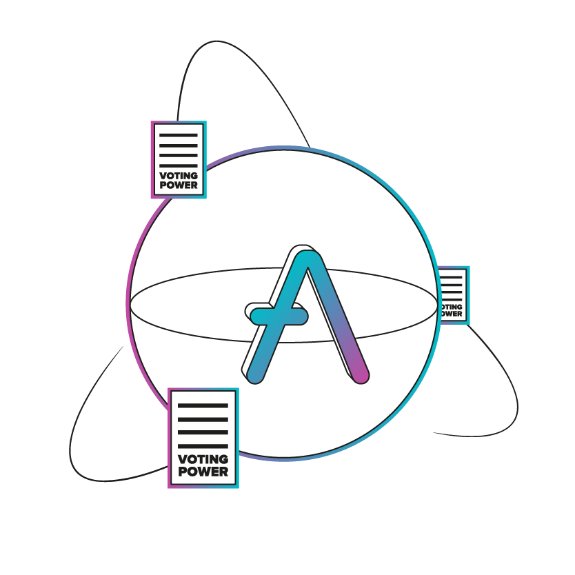

# $AAVE token v3

Next iteration of the AAVE token, optimized for its usage as voting asset on Aave Governance v3.

More detailed description and specification [HERE](./properties.md)

## Setup

This repository requires having Foundry installed in the running machine. Instructions on how to do it [HERE](https://github.com/foundry-rs/foundry#installation).

After having installed Foundry:
1. Add a `.env` file with properly configured `ETH_RPC_URL` and `FORK_BLOCK`, following the example on `.env.example` 
2. `make test` to run the simulation tests.

## Copyright

Copyright © 2023, Aave DAO, represented by its governance smart contracts.

Created by [BGD Labs](https://bgdlabs.com/).

[MIT license](./LICENSE)